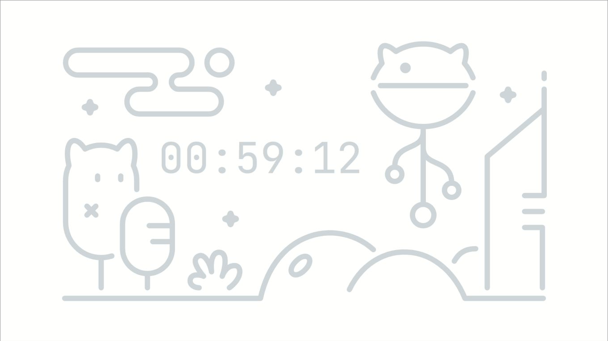

# github-dynamic-wallpaper 
这是一个动态壁纸，其中包含一个来自 GitHub 的插图，自带时间

## 效果
夜晚主题

白天主题

## 可自定义选项
### 主题
- 自动
- 白天
- 夜晚

### Steam创意工坊链接，国内用户可能需要魔法上网
[网页端](https://steamcommunity.com/sharedfiles/filedetails/?id=2314699274)

如果希望直接用 Steam 打开，请复制这个链接 steam://url/CommunityFilePage/2314699274

### 开放源代码许可证
本作品采用<a rel="license" href="http://creativecommons.org/licenses/by-nc/4.0/">知识共享署名-非商业性使用 4.0 国际许可协议</a>进行许可